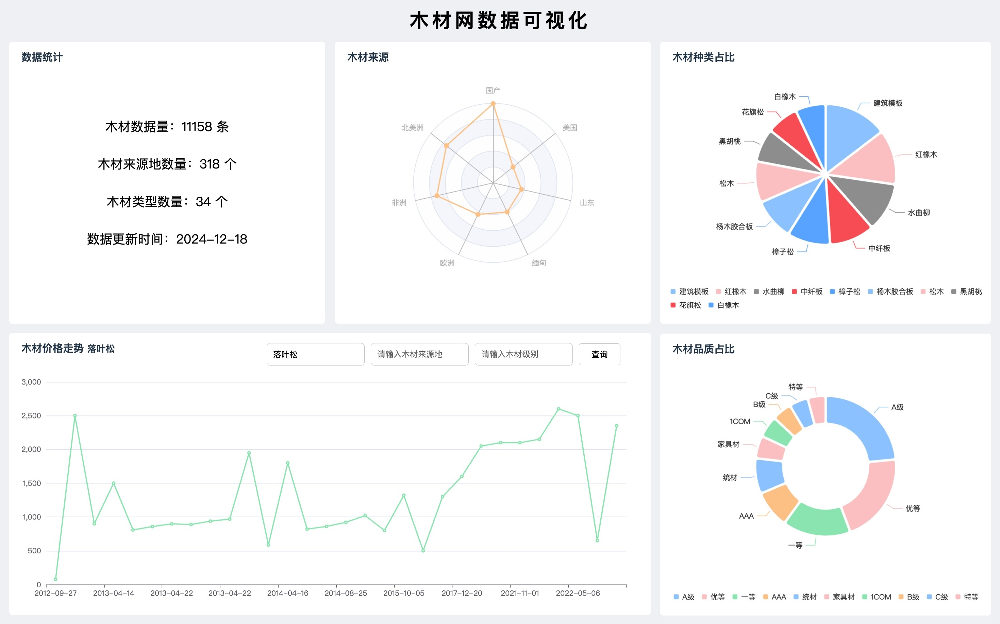

<div align="center">
    <h1>木材网自动化爬虫+数据可视化</h1>
	<h3>python 				flask				 echarts 				selenium</h3>
</div>

## ⚙️ 环境配置

<table style="text-align: center;">
        <tr>
            <td>
              
            </td>
            <td>
                
            </td>
        </tr>
        <tr>
            <td style="font-size: 18px;font-weight: 800;color:red">
                必备(Required)
            </td>
            <td style="font-size: 18px;font-weight: 800;color:orange">
                可选（Optional）
            </td>
        </tr>
    </table>

## 可视化页面



## 一、环境配置 

### 1、配置 conda 解释器环境

根据自己的系统安装 [Miniconda](https://docs.anaconda.com/miniconda/install/#quick-command-line-install) 并配置到环境变量中，重启 VSCode.

#### 2、安装必备依赖

```ini
pip install -i https://mirrors.tuna.tsinghua.edu.cn/pypi/web/simple -r requirements.txt
```

## 二、快速启动 🚀

### 1、简单的爬取和分析

使用 jupyter 启动进入 scrape-chinatimber.ipynb 文件，逐步运行代码，至 **自动化全流程** 标签处

### 2、快速获取全部数据

运行 **自动化全流程** 下全部代码

## 二、访问 可视化 网页 🎉

> [!TIP]
>
> http://localhost:5000


<div align="center">
	<p>༼ つ ◕_◕ ༽つ   File design By <b>ZivYe</b></p>
</div>
